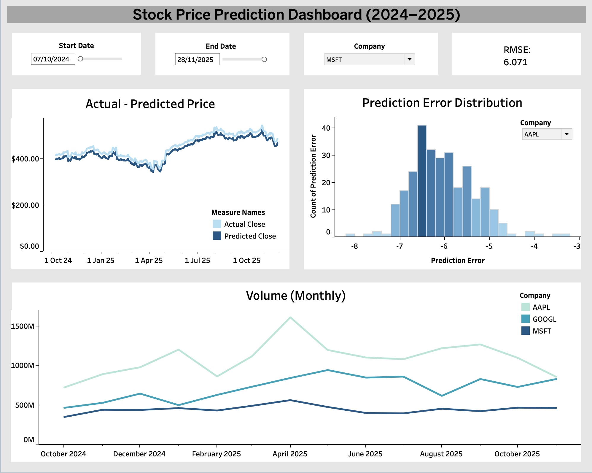

# 📈 End-to-End Stock Price Prediction & Analytics Pipeline


## 📖 Project Context
This project was developed as part of a structured finance & data research programme, designed to simulate real-world data science workflows in financial analytics.
It covers **data ingestion, preprocessing, feature engineering, model development, evaluation, and business-facing visualization.**


## 🎯 Problem Statement
Predict short-horizon stock price movements using historical market data while ensuring realistic evaluation practices (e.g. avoiding look-ahead bias), and communicate results through an interactive dashboard.


## 🧱 Pipeline Overview
* **Data Collection:** Automated ETL pipeline using Yahoo Finance API
* **Data Cleaning & Preparation:** Missing value handling, normalization, type conversion
* **Feature Engineering:** Moving averages, volatility, volume-based indicators
* **Modeling:** Supervised ML models implemented in scikit-learn
* **Evaluation:** Time-based train/test split to prevent data leakage
* **Visualization:** Tableau dashboard for price trends and prediction errors


## 📊 Data Scope

* Frequency: Daily
* Time span: Approximately 1–2 years per asset
* Assets: Single stock per experiment
* Sample size: Hundreds of observations

Given the limited data size and the noisy nature of financial time-series,
the project emphasizes evaluation rigor and diagnostic analysis rather
than maximizing predictive performance.


## 🤖 Modeling & Evaluation
* **Target variable:** Adjusted Close price (`Adj Close`)
* **Models compared (scikit-learn):** 
  * Linear models: **Linear Regression**, **Ridge Regression (α=1.0)**, **Lasso Regression (α=0.1)**
  * Tree-based: **Decision Tree** (max_depth=10, min_samples_split=5, min_samples_leaf=2)
  * Ensembles: **Random Forest** (n_estimators=100, max_depth=10, min_samples_split=5, min_samples_leaf=2), **Gradient Boosting** (n_estimators=100, max_depth=6, learning_rate=0.1)
  * Neural baseline: **MLPRegressor** (hidden layers 100→50, max_iter=500, early_stopping=True, validation_fraction=0.1)

* **Train/validation protocol:**
  * Trained each model on the **training split** and evaluated on a **hold-out validation split**
  * Reported metrics on **both train and validation** to monitor overfitting

* **Metrics reported:**
  * **RMSE** (sqrt(MSE)), **MAE**, and **R²**

* **Model selection criterion:** best model chosen by highest validation R²

* **Hyperparameter tuning** (for selected models):
  * Performed **GridSearchCV** using **TimeSeriesSplit (n_splits=3)** to respect temporal order during cross-validation
  * Optimized for R²
  * Parameter grids defined for:
    * **Random Forest:** n_estimators, max_depth, min_samples_split, min_samples_leaf
    * **Gradient Boosting:** n_estimators, max_depth, learning_rate, min_samples_split
    * **Ridge/Lasso:** α values
  * The best estimator is saved as `*_Tuned` (e.g., `Random_Forest_Tuned`) for downstream comparison.


## 📈 Results Summary

| Model | Val RMSE | Val MAE | Val R² |
|---|---:|---:|---:|
| Linear Regression | 10.82 | 10.76 | 0.932 |
| Ridge Regression | 10.77 | 10.71 | 0.933 |
| **Lasso Regression** | **10.49** | **10.41** | **0.936** |
| Decision Tree | 58.44 | 48.49 | -0.98 |
| Random Forest | 59.71 | 49.47 | -1.06 |
| Gradient Boosting | 56.55 | 46.85 | -0.85 |
| Neural Network (MLP) | 974109 | 763792 | -5.49e8 |

Linear and regularized regression models achieved the strongest
validation performance, while tree-based and neural models exhibited
severe overfitting, with near-perfect training scores but poor
generalization.

This highlights the challenges of applying high-capacity models to
noisy financial time-series and reinforces the importance of
regularization and validation discipline.


## 🔒 Data Integrity
To reflect real trading conditions:
* No random shuffling
* Strict chronological splits
* Feature windows constructed using only past data

This avoids information leakage and overly optimistic performance estimates.


## 📊 Model Diagnostics Dashboard

The dashboard is intended as a diagnostic and exploratory tool,
allowing comparison of predicted vs actual prices, inspection of
prediction error distributions, and contextualization with trading
volume.

It is not designed to represent a deployable trading system, but to
support model evaluation and communication.

## ⚠️ Limitations & Future Work
* Single-asset focus limits generalization
* No macroeconomic or news-based features
* Future work: probabilistic forecasts, multi-asset modeling, regime detection

## 🛠️ How to Run
1. Install dependencies:
   ```bash
   pip install -r requirements.txt
   ```
2. Run data collection and cleaning:
   ```bash
   python src/stock_data_collector.py
   python src/data_cleaning_preparation.py
   ```
3. Run the whole ml pipeline:
   ```bash
   python main.py
   ```